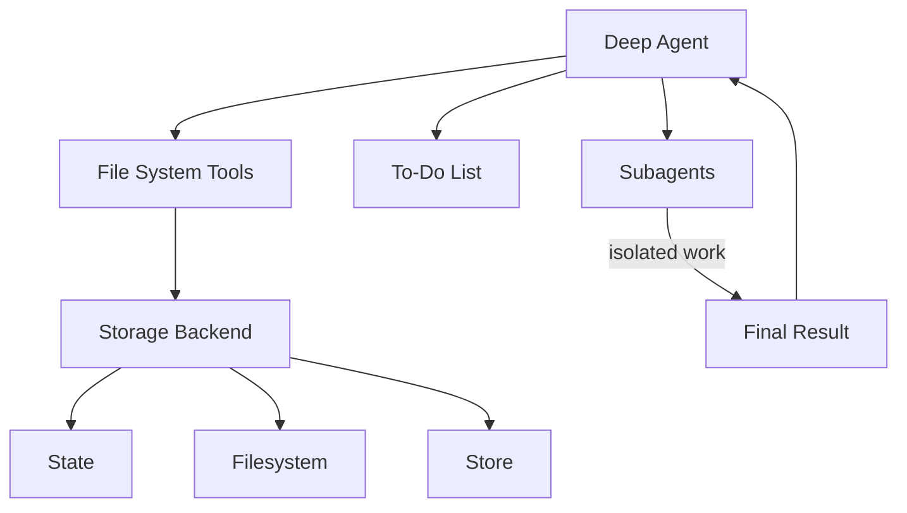
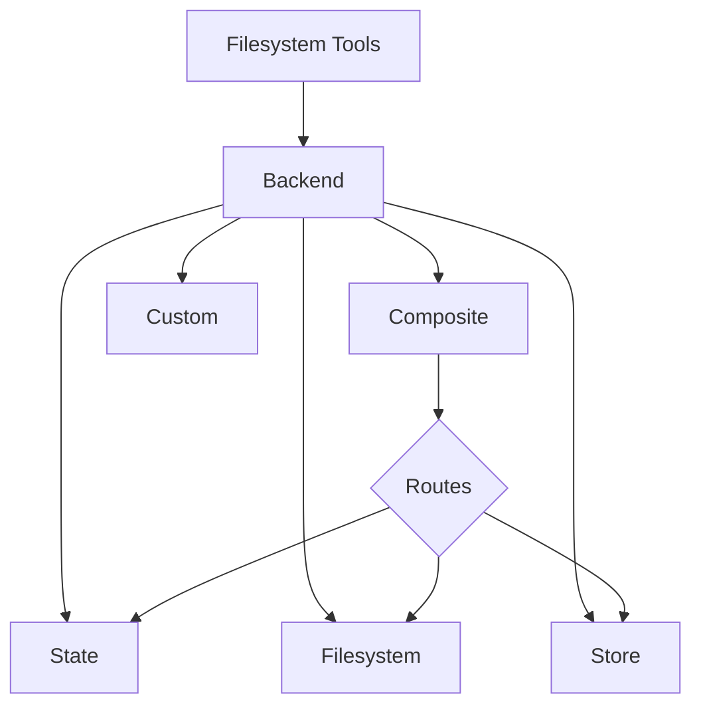

# Agent harness capabilities

We think of `deepagents` as an ["agent harness"](https://blog.langchain.com/agent-frameworks-runtimes-and-harnesses-oh-my/). It is the same core tool calling loop as other agent frameworks, but with built-in tools and capabilities.



This page lists out the components that make up the agent harness.

## File system access

The harness provides six tools for file system operations, making files first-class citizens in the agent's environment:

| Tool         | Description                                                                                   |
| ------------ | --------------------------------------------------------------------------------------------- |
| `ls`         | List files in a directory with metadata (size, modified time)                                 |
| `read_file`  | Read file contents with line numbers, supports offset/limit for large files                   |
| `write_file` | Create new files                                                                              |
| `edit_file`  | Perform exact string replacements in files (with global replace mode)                         |
| `glob`       | Find files matching patterns (e.g., `**/*.py`)                                                |
| `grep`       | Search file contents with multiple output modes (files only, content with context, or counts) |

## Large tool result eviction

The harness automatically dumps large tool results to the file system when they exceed a token threshold, preventing context window saturation.

**How it works:**

* Monitors tool call results for size (default threshold: 20,000 tokens)
* When exceeded, writes the result to a file instead
* Replaces the tool result with a concise reference to the file
* Agent can later read the file if needed

## Pluggable storage backends

The harness abstracts file system operations behind a protocol, allowing different storage strategies for different use cases.

**Available backends:**

1. **StateBackend** - Ephemeral in-memory storage
   * Files live in the agent's state (checkpointed with conversation)
   * Persists within a thread but not across threads
   * Useful for temporary working files

2. **FilesystemBackend** - Real filesystem access
   * Read/write from actual disk
   * Supports virtual mode (sandboxed to a root directory)
   * Integrates with system tools (ripgrep for grep)
   * Security features: path validation, size limits, symlink prevention

3. **StoreBackend** - Persistent cross-conversation storage
   * Uses LangGraph's BaseStore for durability
   * Namespaced per assistant\_id
   * Files persist across conversations
   * Useful for long-term memory or knowledge bases

4. **CompositeBackend** - Route different paths to different backends
   * Example: `/` → StateBackend, `/memories/` → StoreBackend
   * Longest-prefix matching for routing
   * Enables hybrid storage strategies

## Task delegation (subagents)

The harness allows the main agent to create ephemeral "subagents" for isolated multi-step tasks.

**Why it's useful:**

* **Context isolation** - Subagent's work doesn't clutter main agent's context
* **Parallel execution** - Multiple subagents can run concurrently
* **Specialization** - Subagents can have different tools/configurations
* **Token efficiency** - Large subtask context is compressed into a single result

**How it works:**

* Main agent has a `task` tool
* When invoked, creates a fresh agent instance with its own context
* Subagent executes autonomously until completion
* Returns a single final report to the main agent
* Subagents are stateless (can't send multiple messages back)

**Default subagent:**

* "general-purpose" subagent automatically available
* Has filesystem tools by default
* Can be customized with additional tools/middleware

**Custom subagents:**

* Define specialized subagents with specific tools
* Example: code-reviewer, web-researcher, test-runner
* Configure via `subagents` parameter

## Conversation history summarization

The harness automatically compresses old conversation history when token usage becomes excessive.

**Configuration:**

* Triggers at 170,000 tokens
* Keeps the most recent 6 messages intact
* Older messages are summarized by the model

**Why it's useful:**

* Enables very long conversations without hitting context limits
* Preserves recent context while compressing ancient history
* Transparent to the agent (appears as a special system message)

## Dangling tool call repair

The harness fixes message history when tool calls are interrupted or cancelled before receiving results.

**The problem:**

* Agent requests tool call: "Please run X"
* Tool call is interrupted (user cancels, error, etc.)
* Agent sees tool\_call in AIMessage but no corresponding ToolMessage
* This creates an invalid message sequence

**The solution:**

* Detects AIMessages with tool\_calls that have no results
* Creates synthetic ToolMessage responses indicating the call was cancelled
* Repairs the message history before agent execution

**Why it's useful:**

* Prevents agent confusion from incomplete message chains
* Gracefully handles interruptions and errors
* Maintains conversation coherence

## To-do list tracking

The harness provides a `write_todos` tool that agents can use to maintain a structured task list.

**Features:**

* Track multiple tasks with statuses (pending, in\_progress, completed)
* Persisted in agent state
* Helps agent organize complex multi-step work
* Useful for long-running tasks and planning

## Human-in-the-Loop

The harness pauses agent execution at specified tool calls to allow human approval/modification.

**Configuration:**

* Map tool names to interrupt configurations
* Example: `{"edit_file": True}` - pause before every edit
* Can provide approval messages or modify tool inputs

**Why it's useful:**

* Safety gates for destructive operations
* User verification before expensive API calls
* Interactive debugging and guidance

## Prompt caching (Anthropic)

The harness enables Anthropic's prompt caching feature to reduce redundant token processing.

**How it works:**

* Caches portions of the prompt that repeat across turns
* Significantly reduces latency and cost for long system prompts
* Automatically skips for non-Anthropic models

**Why it's useful:**

* System prompts (especially with filesystem docs) can be 5k+ tokens
* These repeat every turn without caching
* Caching provides \~10x speedup and cost reduction

***

<Callout icon="pen-to-square" iconType="regular">
  [Edit this page on GitHub](https://github.com/langchain-ai/docs/edit/main/src/oss/deepagents/harness.mdx) or [file an issue](https://github.com/langchain-ai/docs/issues/new/choose).
</Callout>

<Tip icon="terminal" iconType="regular">
  [Connect these docs](/use-these-docs) to Claude, VSCode, and more via MCP for real-time answers.
</Tip>


---

> To find navigation and other pages in this documentation, fetch the llms.txt file at: https://docs.langchain.com/llms.txt

# Backends

> Choose and configure filesystem backends for deep agents. You can specify routes to different backends, implement virtual filesystems, and enforce policies.

Deep agents expose a filesystem surface to the agent via tools like `ls`, `read_file`, `write_file`, `edit_file`, `glob`, and `grep`. These tools operate through a pluggable backend.



This page explains how to [choose a backend](#specify-a-backend), [route different paths to different backends](#route-to-different-backends), [implement your own virtual filesystem](#use-a-virtual-filesystem) (e.g., S3 or Postgres), [add policy hooks](#add-policy-hooks), and [comply with the backend protocol](#protocol-reference).

## Quickstart

Here are a few pre-built filesystem backends that you can quickly use with your deep agent:

| Built-in backend                                                 | Description                                                                                                                                                                                                                                                                                   |
| ---------------------------------------------------------------- | --------------------------------------------------------------------------------------------------------------------------------------------------------------------------------------------------------------------------------------------------------------------------------------------- |
| [Default](#statebackend-ephemeral)                               | `agent = create_deep_agent()` <br /> Ephemeral in state. The default filesystem backend for an agent is stored in `langgraph` state. Note that this filesystem only persists *for a single thread*.                                                                                           |
| [Local filesystem persistence](#filesystembackend-local-disk)    | `agent = create_deep_agent(backend=FilesystemBackend(root_dir="/Users/nh/Desktop/"))` <br />This gives the deep agent access to your local machine's filesystem. You can specify the root directory that the agent has access to. Note that any provided `root_dir` must be an absolute path. |
| [Durable store (LangGraph store)](#storebackend-langgraph-store) | `agent = create_deep_agent(backend=lambda rt: StoreBackend(rt))` <br />This gives the agent access to long-term storage that is *persisted across threads*. This is great for storing longer term memories or instructions that are applicable to the agent over multiple executions.         |
| [Composite](#compositebackend-router)                            | Ephemeral by default, `/memories/` persisted. The Composite backend is maximally flexible. You can specify different routes in the filesystem to point towards different backends. See Composite routing below for a ready-to-paste example.                                                  |

## Built-in backends

### StateBackend (ephemeral)

```python  theme={null}
# By default we provide a StateBackend
agent = create_deep_agent()

# Under the hood, it looks like
from deepagents.backends import StateBackend

agent = create_deep_agent(
    backend=(lambda rt: StateBackend(rt))   # Note that the tools access State through the runtime.state
)
```

**How it works:**

* Stores files in LangGraph agent state for the current thread.
* Persists across multiple agent turns on the same thread via checkpoints.

**Best for:**

* A scratch pad for the agent to write intermediate results.
* Automatic eviction of large tool outputs which the agent can then read back in piece by piece.

### FilesystemBackend (local disk)

```python  theme={null}
from deepagents.backends import FilesystemBackend

agent = create_deep_agent(
    backend=FilesystemBackend(root_dir=".", virtual_mode=True)
)
```

**How it works:**

* Reads/writes real files under a configurable `root_dir`.
* You can optionally set `virtual_mode=True` to sandbox and normalize paths under `root_dir`.
* Uses secure path resolution, prevents unsafe symlink traversal when possible, can use ripgrep for fast `grep`.

**Best for:**

* Local projects on your machine
* CI sandboxes
* Mounted persistent volumes

### StoreBackend (LangGraph Store)

```python  theme={null}
from langgraph.store.memory import InMemoryStore
from deepagents.backends import StoreBackend

agent = create_deep_agent(
    backend=(lambda rt: StoreBackend(rt)),   # Note that the tools access Store through the runtime.store
    store=InMemoryStore()
)
```

**How it works:**

* Stores files in a LangGraph `BaseStore` provided by the runtime, enabling cross‑thread durable storage.

**Best for:**

* When you already run with a configured LangGraph store (for example, Redis, Postgres, or cloud implementations behind `BaseStore`).
* When you're deploying your agent through LangSmith Deployment (a store is automatically provisioned for your agent).

### CompositeBackend (router)

```python  theme={null}
from deepagents import create_deep_agent
from deepagents.backends import CompositeBackend, StateBackend, StoreBackend
from langgraph.store.memory import InMemoryStore

composite_backend = lambda rt: CompositeBackend(
    default=StateBackend(rt),
    routes={
        "/memories/": StoreBackend(rt),
    }
)

agent = create_deep_agent(
    backend=composite_backend,
    store=InMemoryStore()  # Store passed to create_deep_agent, not backend
)
```

**How it works:**

* Routes file operations to different backends based on path prefix.
* Preserves the original path prefixes in listings and search results.

**Best for:**

* When you want to give your agent both ephemeral and cross-thread storage, a CompositeBackend allows you provide both a StateBackend and StoreBackend
* When you have multiple sources of information that you want to provide to your agent as part of a single filesystem.
  * e.g. You have long-term memories stored under /memories/ in one Store and you also have a custom backend that has documentation accessible at /docs/.

## Specify a backend

* Pass a backend to `create_deep_agent(backend=...)`. The filesystem middleware uses it for all tooling.
* You can pass either:
  * An instance implementing `BackendProtocol` (for example, `FilesystemBackend(root_dir=".")`), or
  * A factory `BackendFactory = Callable[[ToolRuntime], BackendProtocol]` (for backends that need runtime like `StateBackend` or `StoreBackend`).
* If omitted, the default is `lambda rt: StateBackend(rt)`.

## Route to different backends

Route parts of the namespace to different backends. Commonly used to persist `/memories/*` and keep everything else ephemeral.

```python  theme={null}
from deepagents import create_deep_agent
from deepagents.backends import CompositeBackend, StateBackend, FilesystemBackend

composite_backend = lambda rt: CompositeBackend(
    default=StateBackend(rt),
    routes={
        "/memories/": FilesystemBackend(root_dir="/deepagents/myagent", virtual_mode=True),
    },
)

agent = create_deep_agent(backend=composite_backend)
```

Behavior:

* `/workspace/plan.md` → StateBackend (ephemeral)
* `/memories/agent.md` → FilesystemBackend under `/deepagents/myagent`
* `ls`, `glob`, `grep` aggregate results and show original path prefixes.

Notes:

* Longer prefixes win (for example, route `"/memories/projects/"` can override `"/memories/"`).
* For StoreBackend routing, ensure the agent runtime provides a store (`runtime.store`).

## Use a virtual filesystem

Build a custom backend to project a remote or database filesystem (e.g., S3 or Postgres) into the tools namespace.

Design guidelines:

* Paths are absolute (`/x/y.txt`). Decide how to map them to your storage keys/rows.
* Implement `ls_info` and `glob_info` efficiently (server-side listing where available, otherwise local filter).
* Return user-readable error strings for missing files or invalid regex patterns.
* For external persistence, set `files_update=None` in results; only in-state backends should return a `files_update` dict.

S3-style outline:

```python  theme={null}
from deepagents.backends.protocol import BackendProtocol, WriteResult, EditResult
from deepagents.backends.utils import FileInfo, GrepMatch

class S3Backend(BackendProtocol):
    def __init__(self, bucket: str, prefix: str = ""):
        self.bucket = bucket
        self.prefix = prefix.rstrip("/")

    def _key(self, path: str) -> str:
        return f"{self.prefix}{path}"

    def ls_info(self, path: str) -> list[FileInfo]:
        # List objects under _key(path); build FileInfo entries (path, size, modified_at)
        ...

    def read(self, file_path: str, offset: int = 0, limit: int = 2000) -> str:
        # Fetch object; return numbered content or an error string
        ...

    def grep_raw(self, pattern: str, path: str | None = None, glob: str | None = None) -> list[GrepMatch] | str:
        # Optionally filter server‑side; else list and scan content
        ...

    def glob_info(self, pattern: str, path: str = "/") -> list[FileInfo]:
        # Apply glob relative to path across keys
        ...

    def write(self, file_path: str, content: str) -> WriteResult:
        # Enforce create‑only semantics; return WriteResult(path=file_path, files_update=None)
        ...

    def edit(self, file_path: str, old_string: str, new_string: str, replace_all: bool = False) -> EditResult:
        # Read → replace (respect uniqueness vs replace_all) → write → return occurrences
        ...
```

Postgres-style outline:

* Table `files(path text primary key, content text, created_at timestamptz, modified_at timestamptz)`
* Map tool operations onto SQL:
  * `ls_info` uses `WHERE path LIKE $1 || '%'`
  * `glob_info` filter in SQL or fetch then apply glob in Python
  * `grep_raw` can fetch candidate rows by extension or last modified time, then scan lines

## Add policy hooks

Enforce enterprise rules by subclassing or wrapping a backend.

Block writes/edits under selected prefixes (subclass):

```python  theme={null}
from deepagents.backends.filesystem import FilesystemBackend
from deepagents.backends.protocol import WriteResult, EditResult

class GuardedBackend(FilesystemBackend):
    def __init__(self, *, deny_prefixes: list[str], **kwargs):
        super().__init__(**kwargs)
        self.deny_prefixes = [p if p.endswith("/") else p + "/" for p in deny_prefixes]

    def write(self, file_path: str, content: str) -> WriteResult:
        if any(file_path.startswith(p) for p in self.deny_prefixes):
            return WriteResult(error=f"Writes are not allowed under {file_path}")
        return super().write(file_path, content)

    def edit(self, file_path: str, old_string: str, new_string: str, replace_all: bool = False) -> EditResult:
        if any(file_path.startswith(p) for p in self.deny_prefixes):
            return EditResult(error=f"Edits are not allowed under {file_path}")
        return super().edit(file_path, old_string, new_string, replace_all)
```

Generic wrapper (works with any backend):

```python  theme={null}
from deepagents.backends.protocol import BackendProtocol, WriteResult, EditResult
from deepagents.backends.utils import FileInfo, GrepMatch

class PolicyWrapper(BackendProtocol):
    def __init__(self, inner: BackendProtocol, deny_prefixes: list[str] | None = None):
        self.inner = inner
        self.deny_prefixes = [p if p.endswith("/") else p + "/" for p in (deny_prefixes or [])]

    def _deny(self, path: str) -> bool:
        return any(path.startswith(p) for p in self.deny_prefixes)

    def ls_info(self, path: str) -> list[FileInfo]:
        return self.inner.ls_info(path)
    def read(self, file_path: str, offset: int = 0, limit: int = 2000) -> str:
        return self.inner.read(file_path, offset=offset, limit=limit)
    def grep_raw(self, pattern: str, path: str | None = None, glob: str | None = None) -> list[GrepMatch] | str:
        return self.inner.grep_raw(pattern, path, glob)
    def glob_info(self, pattern: str, path: str = "/") -> list[FileInfo]:
        return self.inner.glob_info(pattern, path)
    def write(self, file_path: str, content: str) -> WriteResult:
        if self._deny(file_path):
            return WriteResult(error=f"Writes are not allowed under {file_path}")
        return self.inner.write(file_path, content)
    def edit(self, file_path: str, old_string: str, new_string: str, replace_all: bool = False) -> EditResult:
        if self._deny(file_path):
            return EditResult(error=f"Edits are not allowed under {file_path}")
        return self.inner.edit(file_path, old_string, new_string, replace_all)
```

## Protocol reference

Backends must implement the `BackendProtocol`.

Required endpoints:

* `ls_info(path: str) -> list[FileInfo]`
  * Return entries with at least `path`. Include `is_dir`, `size`, `modified_at` when available. Sort by `path` for deterministic output.
* `read(file_path: str, offset: int = 0, limit: int = 2000) -> str`
  * Return numbered content. On missing file, return `"Error: File '/x' not found"`.
* `grep_raw(pattern: str, path: Optional[str] = None, glob: Optional[str] = None) -> list[GrepMatch] | str`
  * Return structured matches. For an invalid regex, return a string like `"Invalid regex pattern: ..."` (do not raise).
* `glob_info(pattern: str, path: str = "/") -> list[FileInfo]`
  * Return matched files as `FileInfo` entries (empty list if none).
* `write(file_path: str, content: str) -> WriteResult`
  * Create-only. On conflict, return `WriteResult(error=...)`. On success, set `path` and for state backends set `files_update={...}`; external backends should use `files_update=None`.
* `edit(file_path: str, old_string: str, new_string: str, replace_all: bool = False) -> EditResult`
  * Enforce uniqueness of `old_string` unless `replace_all=True`. If not found, return error. Include `occurrences` on success.

Supporting types:

* `WriteResult(error, path, files_update)`
* `EditResult(error, path, files_update, occurrences)`
* `FileInfo` with fields: `path` (required), optionally `is_dir`, `size`, `modified_at`.
* `GrepMatch` with fields: `path`, `line`, `text`.

***

<Callout icon="pen-to-square" iconType="regular">
  [Edit this page on GitHub](https://github.com/langchain-ai/docs/edit/main/src/oss/deepagents/backends.mdx) or [file an issue](https://github.com/langchain-ai/docs/issues/new/choose).
</Callout>

<Tip icon="terminal" iconType="regular">
  [Connect these docs](/use-these-docs) to Claude, VSCode, and more via MCP for real-time answers.
</Tip>


---

> To find navigation and other pages in this documentation, fetch the llms.txt file at: https://docs.langchain.com/llms.txt

# Backends

> Choose and configure filesystem backends for deep agents. You can specify routes to different backends, implement virtual filesystems, and enforce policies.

Deep agents expose a filesystem surface to the agent via tools like `ls`, `read_file`, `write_file`, `edit_file`, `glob`, and `grep`. These tools operate through a pluggable backend.


This page explains how to [choose a backend](#specify-a-backend), [route different paths to different backends](#route-to-different-backends), [implement your own virtual filesystem](#use-a-virtual-filesystem) (e.g., S3 or Postgres), [add policy hooks](#add-policy-hooks), and [comply with the backend protocol](#protocol-reference).

## Quickstart

Here are a few pre-built filesystem backends that you can quickly use with your deep agent:

| Built-in backend                                                 | Description                                                                                                                                                                                                                                                                                   |
| ---------------------------------------------------------------- | --------------------------------------------------------------------------------------------------------------------------------------------------------------------------------------------------------------------------------------------------------------------------------------------- |
| [Default](#statebackend-ephemeral)                               | `agent = create_deep_agent()` <br /> Ephemeral in state. The default filesystem backend for an agent is stored in `langgraph` state. Note that this filesystem only persists *for a single thread*.                                                                                           |
| [Local filesystem persistence](#filesystembackend-local-disk)    | `agent = create_deep_agent(backend=FilesystemBackend(root_dir="/Users/nh/Desktop/"))` <br />This gives the deep agent access to your local machine's filesystem. You can specify the root directory that the agent has access to. Note that any provided `root_dir` must be an absolute path. |
| [Durable store (LangGraph store)](#storebackend-langgraph-store) | `agent = create_deep_agent(backend=lambda rt: StoreBackend(rt))` <br />This gives the agent access to long-term storage that is *persisted across threads*. This is great for storing longer term memories or instructions that are applicable to the agent over multiple executions.         |
| [Composite](#compositebackend-router)                            | Ephemeral by default, `/memories/` persisted. The Composite backend is maximally flexible. You can specify different routes in the filesystem to point towards different backends. See Composite routing below for a ready-to-paste example.                                                  |

## Built-in backends

### StateBackend (ephemeral)

```python  theme={null}
# By default we provide a StateBackend
agent = create_deep_agent()

# Under the hood, it looks like
from deepagents.backends import StateBackend

agent = create_deep_agent(
    backend=(lambda rt: StateBackend(rt))   # Note that the tools access State through the runtime.state
)
```

**How it works:**

* Stores files in LangGraph agent state for the current thread.
* Persists across multiple agent turns on the same thread via checkpoints.

**Best for:**

* A scratch pad for the agent to write intermediate results.
* Automatic eviction of large tool outputs which the agent can then read back in piece by piece.

### FilesystemBackend (local disk)

```python  theme={null}
from deepagents.backends import FilesystemBackend

agent = create_deep_agent(
    backend=FilesystemBackend(root_dir=".", virtual_mode=True)
)
```

**How it works:**

* Reads/writes real files under a configurable `root_dir`.
* You can optionally set `virtual_mode=True` to sandbox and normalize paths under `root_dir`.
* Uses secure path resolution, prevents unsafe symlink traversal when possible, can use ripgrep for fast `grep`.

**Best for:**

* Local projects on your machine
* CI sandboxes
* Mounted persistent volumes

### StoreBackend (LangGraph Store)

```python  theme={null}
from langgraph.store.memory import InMemoryStore
from deepagents.backends import StoreBackend

agent = create_deep_agent(
    backend=(lambda rt: StoreBackend(rt)),   # Note that the tools access Store through the runtime.store
    store=InMemoryStore()
)
```

**How it works:**

* Stores files in a LangGraph `BaseStore` provided by the runtime, enabling cross‑thread durable storage.

**Best for:**

* When you already run with a configured LangGraph store (for example, Redis, Postgres, or cloud implementations behind `BaseStore`).
* When you're deploying your agent through LangSmith Deployment (a store is automatically provisioned for your agent).

### CompositeBackend (router)

```python  theme={null}
from deepagents import create_deep_agent
from deepagents.backends import CompositeBackend, StateBackend, StoreBackend
from langgraph.store.memory import InMemoryStore

composite_backend = lambda rt: CompositeBackend(
    default=StateBackend(rt),
    routes={
        "/memories/": StoreBackend(rt),
    }
)

agent = create_deep_agent(
    backend=composite_backend,
    store=InMemoryStore()  # Store passed to create_deep_agent, not backend
)
```

**How it works:**

* Routes file operations to different backends based on path prefix.
* Preserves the original path prefixes in listings and search results.

**Best for:**

* When you want to give your agent both ephemeral and cross-thread storage, a CompositeBackend allows you provide both a StateBackend and StoreBackend
* When you have multiple sources of information that you want to provide to your agent as part of a single filesystem.
  * e.g. You have long-term memories stored under /memories/ in one Store and you also have a custom backend that has documentation accessible at /docs/.

## Specify a backend

* Pass a backend to `create_deep_agent(backend=...)`. The filesystem middleware uses it for all tooling.
* You can pass either:
  * An instance implementing `BackendProtocol` (for example, `FilesystemBackend(root_dir=".")`), or
  * A factory `BackendFactory = Callable[[ToolRuntime], BackendProtocol]` (for backends that need runtime like `StateBackend` or `StoreBackend`).
* If omitted, the default is `lambda rt: StateBackend(rt)`.

## Route to different backends

Route parts of the namespace to different backends. Commonly used to persist `/memories/*` and keep everything else ephemeral.

```python  theme={null}
from deepagents import create_deep_agent
from deepagents.backends import CompositeBackend, StateBackend, FilesystemBackend

composite_backend = lambda rt: CompositeBackend(
    default=StateBackend(rt),
    routes={
        "/memories/": FilesystemBackend(root_dir="/deepagents/myagent", virtual_mode=True),
    },
)

agent = create_deep_agent(backend=composite_backend)
```

Behavior:

* `/workspace/plan.md` → StateBackend (ephemeral)
* `/memories/agent.md` → FilesystemBackend under `/deepagents/myagent`
* `ls`, `glob`, `grep` aggregate results and show original path prefixes.

Notes:

* Longer prefixes win (for example, route `"/memories/projects/"` can override `"/memories/"`).
* For StoreBackend routing, ensure the agent runtime provides a store (`runtime.store`).

## Use a virtual filesystem

Build a custom backend to project a remote or database filesystem (e.g., S3 or Postgres) into the tools namespace.

Design guidelines:

* Paths are absolute (`/x/y.txt`). Decide how to map them to your storage keys/rows.
* Implement `ls_info` and `glob_info` efficiently (server-side listing where available, otherwise local filter).
* Return user-readable error strings for missing files or invalid regex patterns.
* For external persistence, set `files_update=None` in results; only in-state backends should return a `files_update` dict.

S3-style outline:

```python  theme={null}
from deepagents.backends.protocol import BackendProtocol, WriteResult, EditResult
from deepagents.backends.utils import FileInfo, GrepMatch

class S3Backend(BackendProtocol):
    def __init__(self, bucket: str, prefix: str = ""):
        self.bucket = bucket
        self.prefix = prefix.rstrip("/")

    def _key(self, path: str) -> str:
        return f"{self.prefix}{path}"

    def ls_info(self, path: str) -> list[FileInfo]:
        # List objects under _key(path); build FileInfo entries (path, size, modified_at)
        ...

    def read(self, file_path: str, offset: int = 0, limit: int = 2000) -> str:
        # Fetch object; return numbered content or an error string
        ...

    def grep_raw(self, pattern: str, path: str | None = None, glob: str | None = None) -> list[GrepMatch] | str:
        # Optionally filter server‑side; else list and scan content
        ...

    def glob_info(self, pattern: str, path: str = "/") -> list[FileInfo]:
        # Apply glob relative to path across keys
        ...

    def write(self, file_path: str, content: str) -> WriteResult:
        # Enforce create‑only semantics; return WriteResult(path=file_path, files_update=None)
        ...

    def edit(self, file_path: str, old_string: str, new_string: str, replace_all: bool = False) -> EditResult:
        # Read → replace (respect uniqueness vs replace_all) → write → return occurrences
        ...
```

Postgres-style outline:

* Table `files(path text primary key, content text, created_at timestamptz, modified_at timestamptz)`
* Map tool operations onto SQL:
  * `ls_info` uses `WHERE path LIKE $1 || '%'`
  * `glob_info` filter in SQL or fetch then apply glob in Python
  * `grep_raw` can fetch candidate rows by extension or last modified time, then scan lines

## Add policy hooks

Enforce enterprise rules by subclassing or wrapping a backend.

Block writes/edits under selected prefixes (subclass):

```python  theme={null}
from deepagents.backends.filesystem import FilesystemBackend
from deepagents.backends.protocol import WriteResult, EditResult

class GuardedBackend(FilesystemBackend):
    def __init__(self, *, deny_prefixes: list[str], **kwargs):
        super().__init__(**kwargs)
        self.deny_prefixes = [p if p.endswith("/") else p + "/" for p in deny_prefixes]

    def write(self, file_path: str, content: str) -> WriteResult:
        if any(file_path.startswith(p) for p in self.deny_prefixes):
            return WriteResult(error=f"Writes are not allowed under {file_path}")
        return super().write(file_path, content)

    def edit(self, file_path: str, old_string: str, new_string: str, replace_all: bool = False) -> EditResult:
        if any(file_path.startswith(p) for p in self.deny_prefixes):
            return EditResult(error=f"Edits are not allowed under {file_path}")
        return super().edit(file_path, old_string, new_string, replace_all)
```

Generic wrapper (works with any backend):

```python  theme={null}
from deepagents.backends.protocol import BackendProtocol, WriteResult, EditResult
from deepagents.backends.utils import FileInfo, GrepMatch

class PolicyWrapper(BackendProtocol):
    def __init__(self, inner: BackendProtocol, deny_prefixes: list[str] | None = None):
        self.inner = inner
        self.deny_prefixes = [p if p.endswith("/") else p + "/" for p in (deny_prefixes or [])]

    def _deny(self, path: str) -> bool:
        return any(path.startswith(p) for p in self.deny_prefixes)

    def ls_info(self, path: str) -> list[FileInfo]:
        return self.inner.ls_info(path)
    def read(self, file_path: str, offset: int = 0, limit: int = 2000) -> str:
        return self.inner.read(file_path, offset=offset, limit=limit)
    def grep_raw(self, pattern: str, path: str | None = None, glob: str | None = None) -> list[GrepMatch] | str:
        return self.inner.grep_raw(pattern, path, glob)
    def glob_info(self, pattern: str, path: str = "/") -> list[FileInfo]:
        return self.inner.glob_info(pattern, path)
    def write(self, file_path: str, content: str) -> WriteResult:
        if self._deny(file_path):
            return WriteResult(error=f"Writes are not allowed under {file_path}")
        return self.inner.write(file_path, content)
    def edit(self, file_path: str, old_string: str, new_string: str, replace_all: bool = False) -> EditResult:
        if self._deny(file_path):
            return EditResult(error=f"Edits are not allowed under {file_path}")
        return self.inner.edit(file_path, old_string, new_string, replace_all)
```

## Protocol reference

Backends must implement the `BackendProtocol`.

Required endpoints:

* `ls_info(path: str) -> list[FileInfo]`
  * Return entries with at least `path`. Include `is_dir`, `size`, `modified_at` when available. Sort by `path` for deterministic output.
* `read(file_path: str, offset: int = 0, limit: int = 2000) -> str`
  * Return numbered content. On missing file, return `"Error: File '/x' not found"`.
* `grep_raw(pattern: str, path: Optional[str] = None, glob: Optional[str] = None) -> list[GrepMatch] | str`
  * Return structured matches. For an invalid regex, return a string like `"Invalid regex pattern: ..."` (do not raise).
* `glob_info(pattern: str, path: str = "/") -> list[FileInfo]`
  * Return matched files as `FileInfo` entries (empty list if none).
* `write(file_path: str, content: str) -> WriteResult`
  * Create-only. On conflict, return `WriteResult(error=...)`. On success, set `path` and for state backends set `files_update={...}`; external backends should use `files_update=None`.
* `edit(file_path: str, old_string: str, new_string: str, replace_all: bool = False) -> EditResult`
  * Enforce uniqueness of `old_string` unless `replace_all=True`. If not found, return error. Include `occurrences` on success.

Supporting types:

* `WriteResult(error, path, files_update)`
* `EditResult(error, path, files_update, occurrences)`
* `FileInfo` with fields: `path` (required), optionally `is_dir`, `size`, `modified_at`.
* `GrepMatch` with fields: `path`, `line`, `text`.

***

<Callout icon="pen-to-square" iconType="regular">
  [Edit this page on GitHub](https://github.com/langchain-ai/docs/edit/main/src/oss/deepagents/backends.mdx) or [file an issue](https://github.com/langchain-ai/docs/issues/new/choose).
</Callout>

<Tip icon="terminal" iconType="regular">
  [Connect these docs](/use-these-docs) to Claude, VSCode, and more via MCP for real-time answers.
</Tip>


---

> To find navigation and other pages in this documentation, fetch the llms.txt file at: https://docs.langchain.com/llms.txt

# Backends

> Choose and configure filesystem backends for deep agents. You can specify routes to different backends, implement virtual filesystems, and enforce policies.

Deep agents expose a filesystem surface to the agent via tools like `ls`, `read_file`, `write_file`, `edit_file`, `glob`, and `grep`. These tools operate through a pluggable backend.


This page explains how to [choose a backend](#specify-a-backend), [route different paths to different backends](#route-to-different-backends), [implement your own virtual filesystem](#use-a-virtual-filesystem) (e.g., S3 or Postgres), [add policy hooks](#add-policy-hooks), and [comply with the backend protocol](#protocol-reference).

## Quickstart

Here are a few pre-built filesystem backends that you can quickly use with your deep agent:

| Built-in backend                                                 | Description                                                                                                                                                                                                                                                                                   |
| ---------------------------------------------------------------- | --------------------------------------------------------------------------------------------------------------------------------------------------------------------------------------------------------------------------------------------------------------------------------------------- |
| [Default](#statebackend-ephemeral)                               | `agent = create_deep_agent()` <br /> Ephemeral in state. The default filesystem backend for an agent is stored in `langgraph` state. Note that this filesystem only persists *for a single thread*.                                                                                           |
| [Local filesystem persistence](#filesystembackend-local-disk)    | `agent = create_deep_agent(backend=FilesystemBackend(root_dir="/Users/nh/Desktop/"))` <br />This gives the deep agent access to your local machine's filesystem. You can specify the root directory that the agent has access to. Note that any provided `root_dir` must be an absolute path. |
| [Durable store (LangGraph store)](#storebackend-langgraph-store) | `agent = create_deep_agent(backend=lambda rt: StoreBackend(rt))` <br />This gives the agent access to long-term storage that is *persisted across threads*. This is great for storing longer term memories or instructions that are applicable to the agent over multiple executions.         |
| [Composite](#compositebackend-router)                            | Ephemeral by default, `/memories/` persisted. The Composite backend is maximally flexible. You can specify different routes in the filesystem to point towards different backends. See Composite routing below for a ready-to-paste example.                                                  |

## Built-in backends

### StateBackend (ephemeral)

```python  theme={null}
# By default we provide a StateBackend
agent = create_deep_agent()

# Under the hood, it looks like
from deepagents.backends import StateBackend

agent = create_deep_agent(
    backend=(lambda rt: StateBackend(rt))   # Note that the tools access State through the runtime.state
)
```

**How it works:**

* Stores files in LangGraph agent state for the current thread.
* Persists across multiple agent turns on the same thread via checkpoints.

**Best for:**

* A scratch pad for the agent to write intermediate results.
* Automatic eviction of large tool outputs which the agent can then read back in piece by piece.

### FilesystemBackend (local disk)

```python  theme={null}
from deepagents.backends import FilesystemBackend

agent = create_deep_agent(
    backend=FilesystemBackend(root_dir=".", virtual_mode=True)
)
```

**How it works:**

* Reads/writes real files under a configurable `root_dir`.
* You can optionally set `virtual_mode=True` to sandbox and normalize paths under `root_dir`.
* Uses secure path resolution, prevents unsafe symlink traversal when possible, can use ripgrep for fast `grep`.

**Best for:**

* Local projects on your machine
* CI sandboxes
* Mounted persistent volumes

### StoreBackend (LangGraph Store)

```python  theme={null}
from langgraph.store.memory import InMemoryStore
from deepagents.backends import StoreBackend

agent = create_deep_agent(
    backend=(lambda rt: StoreBackend(rt)),   # Note that the tools access Store through the runtime.store
    store=InMemoryStore()
)
```

**How it works:**

* Stores files in a LangGraph `BaseStore` provided by the runtime, enabling cross‑thread durable storage.

**Best for:**

* When you already run with a configured LangGraph store (for example, Redis, Postgres, or cloud implementations behind `BaseStore`).
* When you're deploying your agent through LangSmith Deployment (a store is automatically provisioned for your agent).

### CompositeBackend (router)

```python  theme={null}
from deepagents import create_deep_agent
from deepagents.backends import CompositeBackend, StateBackend, StoreBackend
from langgraph.store.memory import InMemoryStore

composite_backend = lambda rt: CompositeBackend(
    default=StateBackend(rt),
    routes={
        "/memories/": StoreBackend(rt),
    }
)

agent = create_deep_agent(
    backend=composite_backend,
    store=InMemoryStore()  # Store passed to create_deep_agent, not backend
)
```

**How it works:**

* Routes file operations to different backends based on path prefix.
* Preserves the original path prefixes in listings and search results.

**Best for:**

* When you want to give your agent both ephemeral and cross-thread storage, a CompositeBackend allows you provide both a StateBackend and StoreBackend
* When you have multiple sources of information that you want to provide to your agent as part of a single filesystem.
  * e.g. You have long-term memories stored under /memories/ in one Store and you also have a custom backend that has documentation accessible at /docs/.

## Specify a backend

* Pass a backend to `create_deep_agent(backend=...)`. The filesystem middleware uses it for all tooling.
* You can pass either:
  * An instance implementing `BackendProtocol` (for example, `FilesystemBackend(root_dir=".")`), or
  * A factory `BackendFactory = Callable[[ToolRuntime], BackendProtocol]` (for backends that need runtime like `StateBackend` or `StoreBackend`).
* If omitted, the default is `lambda rt: StateBackend(rt)`.

## Route to different backends

Route parts of the namespace to different backends. Commonly used to persist `/memories/*` and keep everything else ephemeral.

```python  theme={null}
from deepagents import create_deep_agent
from deepagents.backends import CompositeBackend, StateBackend, FilesystemBackend

composite_backend = lambda rt: CompositeBackend(
    default=StateBackend(rt),
    routes={
        "/memories/": FilesystemBackend(root_dir="/deepagents/myagent", virtual_mode=True),
    },
)

agent = create_deep_agent(backend=composite_backend)
```

Behavior:

* `/workspace/plan.md` → StateBackend (ephemeral)
* `/memories/agent.md` → FilesystemBackend under `/deepagents/myagent`
* `ls`, `glob`, `grep` aggregate results and show original path prefixes.

Notes:

* Longer prefixes win (for example, route `"/memories/projects/"` can override `"/memories/"`).
* For StoreBackend routing, ensure the agent runtime provides a store (`runtime.store`).

## Use a virtual filesystem

Build a custom backend to project a remote or database filesystem (e.g., S3 or Postgres) into the tools namespace.

Design guidelines:

* Paths are absolute (`/x/y.txt`). Decide how to map them to your storage keys/rows.
* Implement `ls_info` and `glob_info` efficiently (server-side listing where available, otherwise local filter).
* Return user-readable error strings for missing files or invalid regex patterns.
* For external persistence, set `files_update=None` in results; only in-state backends should return a `files_update` dict.

S3-style outline:

```python  theme={null}
from deepagents.backends.protocol import BackendProtocol, WriteResult, EditResult
from deepagents.backends.utils import FileInfo, GrepMatch

class S3Backend(BackendProtocol):
    def __init__(self, bucket: str, prefix: str = ""):
        self.bucket = bucket
        self.prefix = prefix.rstrip("/")

    def _key(self, path: str) -> str:
        return f"{self.prefix}{path}"

    def ls_info(self, path: str) -> list[FileInfo]:
        # List objects under _key(path); build FileInfo entries (path, size, modified_at)
        ...

    def read(self, file_path: str, offset: int = 0, limit: int = 2000) -> str:
        # Fetch object; return numbered content or an error string
        ...

    def grep_raw(self, pattern: str, path: str | None = None, glob: str | None = None) -> list[GrepMatch] | str:
        # Optionally filter server‑side; else list and scan content
        ...

    def glob_info(self, pattern: str, path: str = "/") -> list[FileInfo]:
        # Apply glob relative to path across keys
        ...

    def write(self, file_path: str, content: str) -> WriteResult:
        # Enforce create‑only semantics; return WriteResult(path=file_path, files_update=None)
        ...

    def edit(self, file_path: str, old_string: str, new_string: str, replace_all: bool = False) -> EditResult:
        # Read → replace (respect uniqueness vs replace_all) → write → return occurrences
        ...
```

Postgres-style outline:

* Table `files(path text primary key, content text, created_at timestamptz, modified_at timestamptz)`
* Map tool operations onto SQL:
  * `ls_info` uses `WHERE path LIKE $1 || '%'`
  * `glob_info` filter in SQL or fetch then apply glob in Python
  * `grep_raw` can fetch candidate rows by extension or last modified time, then scan lines

## Add policy hooks

Enforce enterprise rules by subclassing or wrapping a backend.

Block writes/edits under selected prefixes (subclass):

```python  theme={null}
from deepagents.backends.filesystem import FilesystemBackend
from deepagents.backends.protocol import WriteResult, EditResult

class GuardedBackend(FilesystemBackend):
    def __init__(self, *, deny_prefixes: list[str], **kwargs):
        super().__init__(**kwargs)
        self.deny_prefixes = [p if p.endswith("/") else p + "/" for p in deny_prefixes]

    def write(self, file_path: str, content: str) -> WriteResult:
        if any(file_path.startswith(p) for p in self.deny_prefixes):
            return WriteResult(error=f"Writes are not allowed under {file_path}")
        return super().write(file_path, content)

    def edit(self, file_path: str, old_string: str, new_string: str, replace_all: bool = False) -> EditResult:
        if any(file_path.startswith(p) for p in self.deny_prefixes):
            return EditResult(error=f"Edits are not allowed under {file_path}")
        return super().edit(file_path, old_string, new_string, replace_all)
```

Generic wrapper (works with any backend):

```python  theme={null}
from deepagents.backends.protocol import BackendProtocol, WriteResult, EditResult
from deepagents.backends.utils import FileInfo, GrepMatch

class PolicyWrapper(BackendProtocol):
    def __init__(self, inner: BackendProtocol, deny_prefixes: list[str] | None = None):
        self.inner = inner
        self.deny_prefixes = [p if p.endswith("/") else p + "/" for p in (deny_prefixes or [])]

    def _deny(self, path: str) -> bool:
        return any(path.startswith(p) for p in self.deny_prefixes)

    def ls_info(self, path: str) -> list[FileInfo]:
        return self.inner.ls_info(path)
    def read(self, file_path: str, offset: int = 0, limit: int = 2000) -> str:
        return self.inner.read(file_path, offset=offset, limit=limit)
    def grep_raw(self, pattern: str, path: str | None = None, glob: str | None = None) -> list[GrepMatch] | str:
        return self.inner.grep_raw(pattern, path, glob)
    def glob_info(self, pattern: str, path: str = "/") -> list[FileInfo]:
        return self.inner.glob_info(pattern, path)
    def write(self, file_path: str, content: str) -> WriteResult:
        if self._deny(file_path):
            return WriteResult(error=f"Writes are not allowed under {file_path}")
        return self.inner.write(file_path, content)
    def edit(self, file_path: str, old_string: str, new_string: str, replace_all: bool = False) -> EditResult:
        if self._deny(file_path):
            return EditResult(error=f"Edits are not allowed under {file_path}")
        return self.inner.edit(file_path, old_string, new_string, replace_all)
```

## Protocol reference

Backends must implement the `BackendProtocol`.

Required endpoints:

* `ls_info(path: str) -> list[FileInfo]`
  * Return entries with at least `path`. Include `is_dir`, `size`, `modified_at` when available. Sort by `path` for deterministic output.
* `read(file_path: str, offset: int = 0, limit: int = 2000) -> str`
  * Return numbered content. On missing file, return `"Error: File '/x' not found"`.
* `grep_raw(pattern: str, path: Optional[str] = None, glob: Optional[str] = None) -> list[GrepMatch] | str`
  * Return structured matches. For an invalid regex, return a string like `"Invalid regex pattern: ..."` (do not raise).
* `glob_info(pattern: str, path: str = "/") -> list[FileInfo]`
  * Return matched files as `FileInfo` entries (empty list if none).
* `write(file_path: str, content: str) -> WriteResult`
  * Create-only. On conflict, return `WriteResult(error=...)`. On success, set `path` and for state backends set `files_update={...}`; external backends should use `files_update=None`.
* `edit(file_path: str, old_string: str, new_string: str, replace_all: bool = False) -> EditResult`
  * Enforce uniqueness of `old_string` unless `replace_all=True`. If not found, return error. Include `occurrences` on success.

Supporting types:

* `WriteResult(error, path, files_update)`
* `EditResult(error, path, files_update, occurrences)`
* `FileInfo` with fields: `path` (required), optionally `is_dir`, `size`, `modified_at`.
* `GrepMatch` with fields: `path`, `line`, `text`.

***

<Callout icon="pen-to-square" iconType="regular">
  [Edit this page on GitHub](https://github.com/langchain-ai/docs/edit/main/src/oss/deepagents/backends.mdx) or [file an issue](https://github.com/langchain-ai/docs/issues/new/choose).
</Callout>

<Tip icon="terminal" iconType="regular">
  [Connect these docs](/use-these-docs) to Claude, VSCode, and more via MCP for real-time answers.
</Tip>


---

> To find navigation and other pages in this documentation, fetch the llms.txt file at: https://docs.langchain.com/llms.txt

# Backends

> Choose and configure filesystem backends for deep agents. You can specify routes to different backends, implement virtual filesystems, and enforce policies.

Deep agents expose a filesystem surface to the agent via tools like `ls`, `read_file`, `write_file`, `edit_file`, `glob`, and `grep`. These tools operate through a pluggable backend.


This page explains how to [choose a backend](#specify-a-backend), [route different paths to different backends](#route-to-different-backends), [implement your own virtual filesystem](#use-a-virtual-filesystem) (e.g., S3 or Postgres), [add policy hooks](#add-policy-hooks), and [comply with the backend protocol](#protocol-reference).

## Quickstart

Here are a few pre-built filesystem backends that you can quickly use with your deep agent:

| Built-in backend                                                 | Description                                                                                                                                                                                                                                                                                   |
| ---------------------------------------------------------------- | --------------------------------------------------------------------------------------------------------------------------------------------------------------------------------------------------------------------------------------------------------------------------------------------- |
| [Default](#statebackend-ephemeral)                               | `agent = create_deep_agent()` <br /> Ephemeral in state. The default filesystem backend for an agent is stored in `langgraph` state. Note that this filesystem only persists *for a single thread*.                                                                                           |
| [Local filesystem persistence](#filesystembackend-local-disk)    | `agent = create_deep_agent(backend=FilesystemBackend(root_dir="/Users/nh/Desktop/"))` <br />This gives the deep agent access to your local machine's filesystem. You can specify the root directory that the agent has access to. Note that any provided `root_dir` must be an absolute path. |
| [Durable store (LangGraph store)](#storebackend-langgraph-store) | `agent = create_deep_agent(backend=lambda rt: StoreBackend(rt))` <br />This gives the agent access to long-term storage that is *persisted across threads*. This is great for storing longer term memories or instructions that are applicable to the agent over multiple executions.         |
| [Composite](#compositebackend-router)                            | Ephemeral by default, `/memories/` persisted. The Composite backend is maximally flexible. You can specify different routes in the filesystem to point towards different backends. See Composite routing below for a ready-to-paste example.                                                  |

## Built-in backends

### StateBackend (ephemeral)

```python  theme={null}
# By default we provide a StateBackend
agent = create_deep_agent()

# Under the hood, it looks like
from deepagents.backends import StateBackend

agent = create_deep_agent(
    backend=(lambda rt: StateBackend(rt))   # Note that the tools access State through the runtime.state
)
```

**How it works:**

* Stores files in LangGraph agent state for the current thread.
* Persists across multiple agent turns on the same thread via checkpoints.

**Best for:**

* A scratch pad for the agent to write intermediate results.
* Automatic eviction of large tool outputs which the agent can then read back in piece by piece.

### FilesystemBackend (local disk)

```python  theme={null}
from deepagents.backends import FilesystemBackend

agent = create_deep_agent(
    backend=FilesystemBackend(root_dir=".", virtual_mode=True)
)
```

**How it works:**

* Reads/writes real files under a configurable `root_dir`.
* You can optionally set `virtual_mode=True` to sandbox and normalize paths under `root_dir`.
* Uses secure path resolution, prevents unsafe symlink traversal when possible, can use ripgrep for fast `grep`.

**Best for:**

* Local projects on your machine
* CI sandboxes
* Mounted persistent volumes

### StoreBackend (LangGraph Store)

```python  theme={null}
from langgraph.store.memory import InMemoryStore
from deepagents.backends import StoreBackend

agent = create_deep_agent(
    backend=(lambda rt: StoreBackend(rt)),   # Note that the tools access Store through the runtime.store
    store=InMemoryStore()
)
```

**How it works:**

* Stores files in a LangGraph `BaseStore` provided by the runtime, enabling cross‑thread durable storage.

**Best for:**

* When you already run with a configured LangGraph store (for example, Redis, Postgres, or cloud implementations behind `BaseStore`).
* When you're deploying your agent through LangSmith Deployment (a store is automatically provisioned for your agent).

### CompositeBackend (router)

```python  theme={null}
from deepagents import create_deep_agent
from deepagents.backends import CompositeBackend, StateBackend, StoreBackend
from langgraph.store.memory import InMemoryStore

composite_backend = lambda rt: CompositeBackend(
    default=StateBackend(rt),
    routes={
        "/memories/": StoreBackend(rt),
    }
)

agent = create_deep_agent(
    backend=composite_backend,
    store=InMemoryStore()  # Store passed to create_deep_agent, not backend
)
```

**How it works:**

* Routes file operations to different backends based on path prefix.
* Preserves the original path prefixes in listings and search results.

**Best for:**

* When you want to give your agent both ephemeral and cross-thread storage, a CompositeBackend allows you provide both a StateBackend and StoreBackend
* When you have multiple sources of information that you want to provide to your agent as part of a single filesystem.
  * e.g. You have long-term memories stored under /memories/ in one Store and you also have a custom backend that has documentation accessible at /docs/.

## Specify a backend

* Pass a backend to `create_deep_agent(backend=...)`. The filesystem middleware uses it for all tooling.
* You can pass either:
  * An instance implementing `BackendProtocol` (for example, `FilesystemBackend(root_dir=".")`), or
  * A factory `BackendFactory = Callable[[ToolRuntime], BackendProtocol]` (for backends that need runtime like `StateBackend` or `StoreBackend`).
* If omitted, the default is `lambda rt: StateBackend(rt)`.

## Route to different backends

Route parts of the namespace to different backends. Commonly used to persist `/memories/*` and keep everything else ephemeral.

```python  theme={null}
from deepagents import create_deep_agent
from deepagents.backends import CompositeBackend, StateBackend, FilesystemBackend

composite_backend = lambda rt: CompositeBackend(
    default=StateBackend(rt),
    routes={
        "/memories/": FilesystemBackend(root_dir="/deepagents/myagent", virtual_mode=True),
    },
)

agent = create_deep_agent(backend=composite_backend)
```

Behavior:

* `/workspace/plan.md` → StateBackend (ephemeral)
* `/memories/agent.md` → FilesystemBackend under `/deepagents/myagent`
* `ls`, `glob`, `grep` aggregate results and show original path prefixes.

Notes:

* Longer prefixes win (for example, route `"/memories/projects/"` can override `"/memories/"`).
* For StoreBackend routing, ensure the agent runtime provides a store (`runtime.store`).

## Use a virtual filesystem

Build a custom backend to project a remote or database filesystem (e.g., S3 or Postgres) into the tools namespace.

Design guidelines:

* Paths are absolute (`/x/y.txt`). Decide how to map them to your storage keys/rows.
* Implement `ls_info` and `glob_info` efficiently (server-side listing where available, otherwise local filter).
* Return user-readable error strings for missing files or invalid regex patterns.
* For external persistence, set `files_update=None` in results; only in-state backends should return a `files_update` dict.

S3-style outline:

```python  theme={null}
from deepagents.backends.protocol import BackendProtocol, WriteResult, EditResult
from deepagents.backends.utils import FileInfo, GrepMatch

class S3Backend(BackendProtocol):
    def __init__(self, bucket: str, prefix: str = ""):
        self.bucket = bucket
        self.prefix = prefix.rstrip("/")

    def _key(self, path: str) -> str:
        return f"{self.prefix}{path}"

    def ls_info(self, path: str) -> list[FileInfo]:
        # List objects under _key(path); build FileInfo entries (path, size, modified_at)
        ...

    def read(self, file_path: str, offset: int = 0, limit: int = 2000) -> str:
        # Fetch object; return numbered content or an error string
        ...

    def grep_raw(self, pattern: str, path: str | None = None, glob: str | None = None) -> list[GrepMatch] | str:
        # Optionally filter server‑side; else list and scan content
        ...

    def glob_info(self, pattern: str, path: str = "/") -> list[FileInfo]:
        # Apply glob relative to path across keys
        ...

    def write(self, file_path: str, content: str) -> WriteResult:
        # Enforce create‑only semantics; return WriteResult(path=file_path, files_update=None)
        ...

    def edit(self, file_path: str, old_string: str, new_string: str, replace_all: bool = False) -> EditResult:
        # Read → replace (respect uniqueness vs replace_all) → write → return occurrences
        ...
```

Postgres-style outline:

* Table `files(path text primary key, content text, created_at timestamptz, modified_at timestamptz)`
* Map tool operations onto SQL:
  * `ls_info` uses `WHERE path LIKE $1 || '%'`
  * `glob_info` filter in SQL or fetch then apply glob in Python
  * `grep_raw` can fetch candidate rows by extension or last modified time, then scan lines

## Add policy hooks

Enforce enterprise rules by subclassing or wrapping a backend.

Block writes/edits under selected prefixes (subclass):

```python  theme={null}
from deepagents.backends.filesystem import FilesystemBackend
from deepagents.backends.protocol import WriteResult, EditResult

class GuardedBackend(FilesystemBackend):
    def __init__(self, *, deny_prefixes: list[str], **kwargs):
        super().__init__(**kwargs)
        self.deny_prefixes = [p if p.endswith("/") else p + "/" for p in deny_prefixes]

    def write(self, file_path: str, content: str) -> WriteResult:
        if any(file_path.startswith(p) for p in self.deny_prefixes):
            return WriteResult(error=f"Writes are not allowed under {file_path}")
        return super().write(file_path, content)

    def edit(self, file_path: str, old_string: str, new_string: str, replace_all: bool = False) -> EditResult:
        if any(file_path.startswith(p) for p in self.deny_prefixes):
            return EditResult(error=f"Edits are not allowed under {file_path}")
        return super().edit(file_path, old_string, new_string, replace_all)
```

Generic wrapper (works with any backend):

```python  theme={null}
from deepagents.backends.protocol import BackendProtocol, WriteResult, EditResult
from deepagents.backends.utils import FileInfo, GrepMatch

class PolicyWrapper(BackendProtocol):
    def __init__(self, inner: BackendProtocol, deny_prefixes: list[str] | None = None):
        self.inner = inner
        self.deny_prefixes = [p if p.endswith("/") else p + "/" for p in (deny_prefixes or [])]

    def _deny(self, path: str) -> bool:
        return any(path.startswith(p) for p in self.deny_prefixes)

    def ls_info(self, path: str) -> list[FileInfo]:
        return self.inner.ls_info(path)
    def read(self, file_path: str, offset: int = 0, limit: int = 2000) -> str:
        return self.inner.read(file_path, offset=offset, limit=limit)
    def grep_raw(self, pattern: str, path: str | None = None, glob: str | None = None) -> list[GrepMatch] | str:
        return self.inner.grep_raw(pattern, path, glob)
    def glob_info(self, pattern: str, path: str = "/") -> list[FileInfo]:
        return self.inner.glob_info(pattern, path)
    def write(self, file_path: str, content: str) -> WriteResult:
        if self._deny(file_path):
            return WriteResult(error=f"Writes are not allowed under {file_path}")
        return self.inner.write(file_path, content)
    def edit(self, file_path: str, old_string: str, new_string: str, replace_all: bool = False) -> EditResult:
        if self._deny(file_path):
            return EditResult(error=f"Edits are not allowed under {file_path}")
        return self.inner.edit(file_path, old_string, new_string, replace_all)
```

## Protocol reference

Backends must implement the `BackendProtocol`.

Required endpoints:

* `ls_info(path: str) -> list[FileInfo]`
  * Return entries with at least `path`. Include `is_dir`, `size`, `modified_at` when available. Sort by `path` for deterministic output.
* `read(file_path: str, offset: int = 0, limit: int = 2000) -> str`
  * Return numbered content. On missing file, return `"Error: File '/x' not found"`.
* `grep_raw(pattern: str, path: Optional[str] = None, glob: Optional[str] = None) -> list[GrepMatch] | str`
  * Return structured matches. For an invalid regex, return a string like `"Invalid regex pattern: ..."` (do not raise).
* `glob_info(pattern: str, path: str = "/") -> list[FileInfo]`
  * Return matched files as `FileInfo` entries (empty list if none).
* `write(file_path: str, content: str) -> WriteResult`
  * Create-only. On conflict, return `WriteResult(error=...)`. On success, set `path` and for state backends set `files_update={...}`; external backends should use `files_update=None`.
* `edit(file_path: str, old_string: str, new_string: str, replace_all: bool = False) -> EditResult`
  * Enforce uniqueness of `old_string` unless `replace_all=True`. If not found, return error. Include `occurrences` on success.

Supporting types:

* `WriteResult(error, path, files_update)`
* `EditResult(error, path, files_update, occurrences)`
* `FileInfo` with fields: `path` (required), optionally `is_dir`, `size`, `modified_at`.
* `GrepMatch` with fields: `path`, `line`, `text`.

***

<Callout icon="pen-to-square" iconType="regular">
  [Edit this page on GitHub](https://github.com/langchain-ai/docs/edit/main/src/oss/deepagents/backends.mdx) or [file an issue](https://github.com/langchain-ai/docs/issues/new/choose).
</Callout>

<Tip icon="terminal" iconType="regular">
  [Connect these docs](/use-these-docs) to Claude, VSCode, and more via MCP for real-time answers.
</Tip>


---

> To find navigation and other pages in this documentation, fetch the llms.txt file at: https://docs.langchain.com/llms.txt

